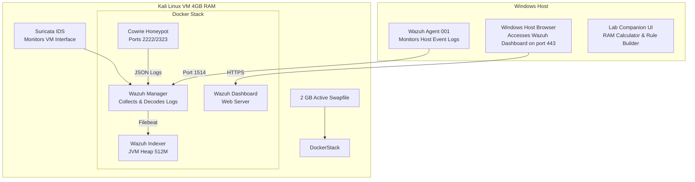
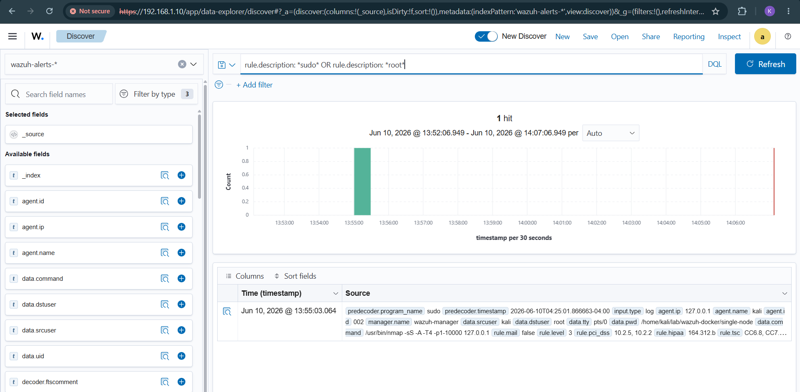
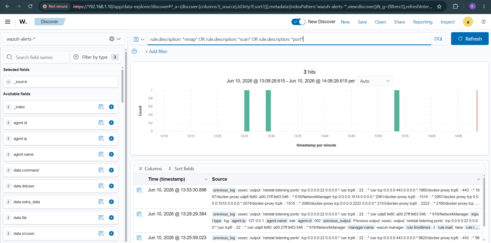
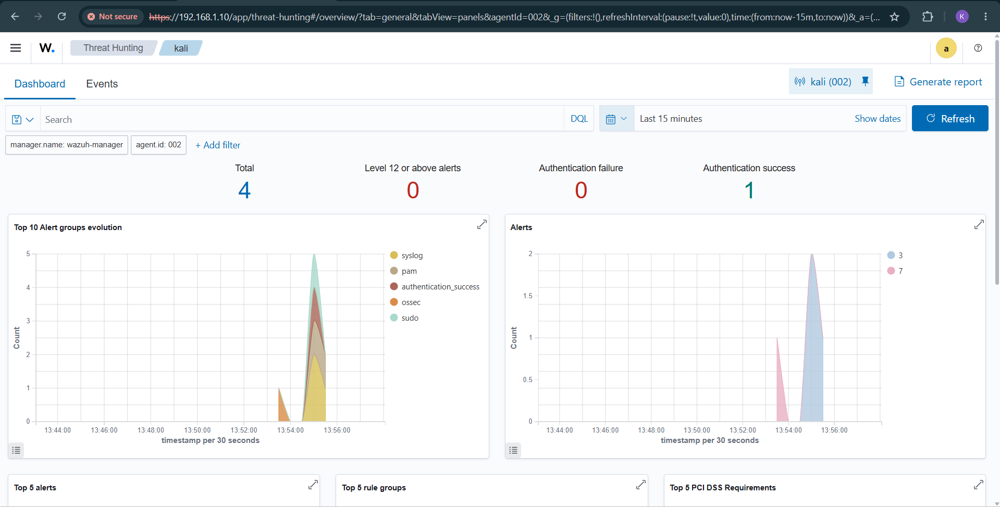
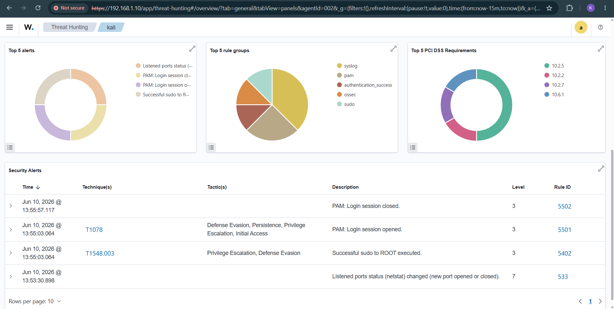

# 🛡️ SIEM & Honeypot Integration Lab

An advanced, low-resource **SIEM (Security Information and Event Management) + Honeypot + IDS Integration Lab** designed to run efficiently on host systems with limited hardware (allocating exactly **4 GB RAM and 2 CPU Cores** to a Kali Linux Guest VM). 

This project integrates **Wazuh SIEM**, **Suricata IDS**, and **Cowrie SSH/Telnet Honeypot** to create a fully monitored threat detection and system auditing laboratory. It features local host browser offloading, customized low-spec container profiles, and a bespoke HTML5 companion panel to guide you through lab scenarios.

---

## 🏗️ Lab Architecture

The lab splits workloads between your Windows Host and a Kali Linux Guest VM to maximize performance and prevent RAM exhaustion.



---

## 🚀 Key Features

*   **Low-Resource Tuning**: Custom [wazuh-lowspec-compose.yml](lab-configs/wazuh-lowspec-compose.yml) environment limits the indexer heap to `512MB` and disables heavy non-essential Java submodules.
*   **Active Swap Protection**: Automation script [setup-swap.sh](lab-configs/setup-swap.sh) allocates and registers a persistent `2GB` local virtual safety net inside Kali.
*   **Host-to-VM Scripting**: Powershell pipeline [deploy-to-kali.ps1](deploy-to-kali.ps1) handles SSH handshakes and copies config files directly into the Kali VM folder `~/lab/configs/`.
*   **Interactive Companion**: Local static web console ([index.html](index.html), [styles.css](styles.css), [app.js](app.js)) that runs on your Windows host to compile Suricata rules, triage RAM loads, and export Markdown incident reports.

---

## 🔍 Security Audit & Lab Scenarios

The SIEM pipeline was validated against multiple common attack vectors. The following evidence highlights detection rules triggered by the Wazuh server monitoring the local Kali Guest Agent (**ID 002**):

### Scenario 1: Privilege Escalation Auditing
When an user executes commands utilizing `sudo` privileges (e.g. initiating system recon scans), Wazuh's OSSEC log engine detects the shell subprocess call.

*   **Triggered Event**: `Successful sudo to ROOT executed`
*   **Wazuh Rule ID**: `5402` (Level 3 Alert)
*   **MITRE ATT&CK Mapping**: **T1548.003** (Abuse Elevation Control Mechanism: Sudo/Su)
*   **Command Logged**: `/usr/bin/nmap -sS -A -T4 -p1-10000 127.0.0.1`

#### Discover Search Verification:
Using the search query `rule.description: *sudo* OR rule.description: *root*` in the **Discover** tab, we locate the raw log containing the executing source user (`kali`), destination user (`root`), and command arguments:



---

### Scenario 2: Listening Port Audit (Reconnaissance Detection)
Wazuh runs periodic checks comparing the host's listening sockets. When a port is opened or modified, a system diff alert is triggered.

*   **Triggered Event**: `Listened ports status (netstat) changed (new port opened or closed)`
*   **Wazuh Rule ID**: `533` (Level 7 Alert)
*   **Context**: Identifies when services are shut down, new listener daemons are initialized, or local port modifications occur during reconnaissance.

#### Discover Search Verification:
Using the search query `rule.description: *nmap* OR rule.description: *scan* OR rule.description: *port*` in the **Discover** tab, we verify the historical netstat listening port changes:



---

### Scenario 3: Agent Threat Hunting Dashboard
The **Threat Hunting** dashboard visualizes active agents and alerts. In the screenshot below, the `kali` agent (**ID 002**) shows successfully aggregated events:



The detailed security alerts panel lists all active warnings generated by the local environment:



---

## 🛠️ Installation & Setup

### 1. Configure Kali Swap Space
Run the swap allocator script inside your Kali VM terminal to prevent out-of-memory lockups:
```bash
chmod +x lab-configs/setup-swap.sh
sudo ./lab-configs/setup-swap.sh
```

### 2. Deploy Wazuh Single-Node Stack
Ensure Docker is installed, copy the custom low-spec configuration over the default compose file, and build:
```bash
# Overwrite with low-spec settings
cp lab-configs/wazuh-lowspec-compose.yml ~/lab/wazuh-docker/single-node/docker-compose.yml

# Re-create and launch containers
cd ~/lab/wazuh-docker/single-node
docker compose down
docker compose up -d
```

### 3. Enroll Windows Host Agent
1. Open the Wazuh dashboard via your Windows host at `https://<KALI_VM_IP>`.
2. Click **Add Agent** and follow the instructions to download and install the agent MSI on your Windows Host.
3. Once active, run the test alert command inside your Windows Command Prompt as Administrator:
   ```cmd
   net user wazuh_test_user P@ssword123! /add
   ```
4. Verify the **User account created** alert (Rule ID `60109`) appears inside the **Security Events** console in the dashboard.

---

## 📄 License
This project is licensed under the MIT License - see the [LICENSE](LICENSE) file for details.
