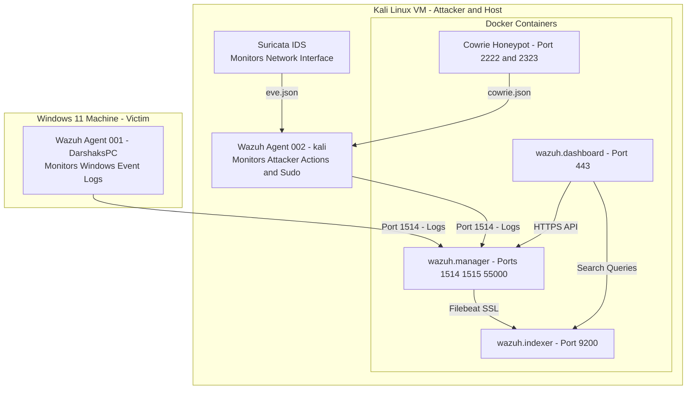
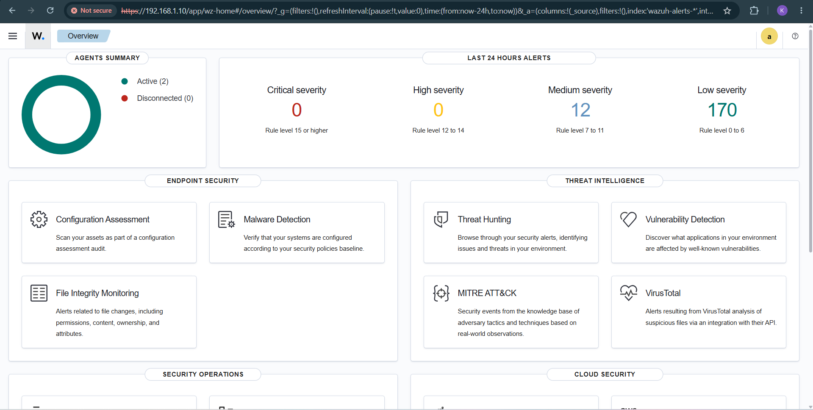
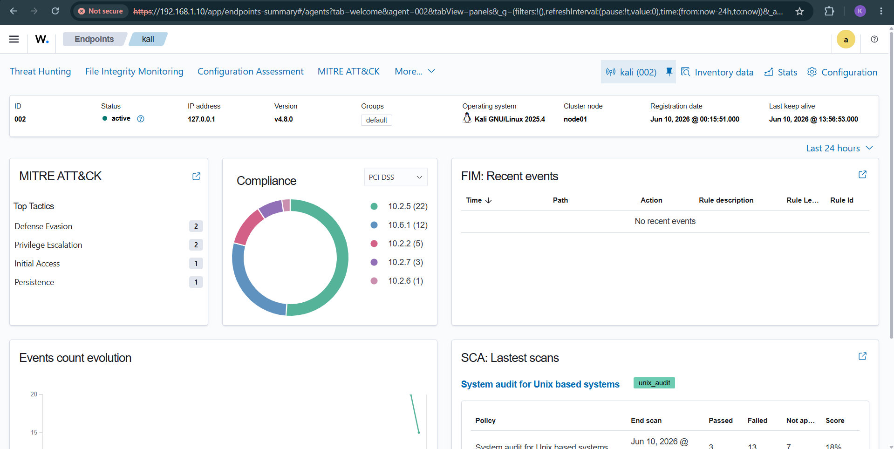

# Wazuh SIEM Attack Detection Lab

Hands-on home lab deploying Wazuh SIEM via Docker to detect real-time attacks including SSH brute force, privilege escalation, and port scanning across Windows and Linux endpoints.

---

## 🏗️ Lab Architecture

The lab is split between a Windows 11 host and a Kali Linux Guest VM to maximize performance and simulate realistic attacker vs. victim scenarios.



---

## 📋 What This Project Is

A fully functional Security Information and Event Management (SIEM) lab built from scratch using Wazuh deployed via Docker on Kali Linux. The lab monitors two real endpoints—a Windows 11 machine and a Kali Linux attacker machine—and detects live attack scenarios including SSH brute force, post-exploitation commands, directory traversal, and port scanning. All detections are visible in the Wazuh dashboard with MITRE ATT&CK mappings.

---

## 💻 Tech Stack

*   **Wazuh 4.8.0** — SIEM platform (manager + indexer + dashboard)
*   **Docker + Docker Compose** — Single-node deployment
*   **OpenSearch 2.10.0** — Backend indexing (via wazuh-indexer)
*   **Filebeat** — Log shipping from manager to indexer
*   **Cowrie Honeypot** — SSH honeypot listening on port 2222
*   **Kali Linux** — Host machine + attacker agent (agent 002)
*   **Windows 11** — Monitored endpoint (agent 001)
*   **Hydra** — SSH brute force tool
*   **Nmap** — Port scanner / recon tool

---

## 👥 Agents Enrolled

| ID | Name | OS | Role |
| :--- | :--- | :--- | :--- |
| **000** | wazuh-manager | Amazon Linux (container) | Central SIEM Manager |
| **001** | DarshaksPC | Microsoft Windows 11 Pro | Monitored endpoint (Victim machine) |
| **002** | kali | Kali GNU/Linux 2025.4 | Attacker machine (Attack origin) |

### Why two agents matter:
*   **Agent 001 (Windows)** gives visibility into Windows event logs, SCA compliance checks (CIS benchmark), and lateral movement detection on the victim side.
*   **Agent 002 (Kali)** captures the attacker's own actions—brute force attempts, privilege escalation, reconnaissance commands—from the attacker's perspective. This is critical for end-to-end attack chain visibility inside a single SIEM.

---

## ⚔️ Attack Scenarios Executed & Detected

### Scenario 1 — SSH Brute Force (Cowrie Honeypot)
Simulated a credential stuffing attack against a honeypot SSH service on port 2222 using Hydra with the `rockyou.txt` wordlist.

*   **Command used**:
    ```bash
    hydra -l root -P /usr/share/wordlists/rockyou.txt ssh://127.0.0.1 -s 2222 -t 4 -V
    ```
*   **What Wazuh detected**: Multiple authentication failures followed by successful logins (passwords: `12345`, `123456789`, `password`). Rule groups: `sshd`, `authentication_failure`.

---

### Scenario 2 — Post-Exploitation / Privilege Escalation
Simulated attacker enumeration and privilege escalation commands after gaining initial access.

*   **Commands used**:
    ```bash
    whoami && id
    cat /etc/passwd
    sudo cat /etc/shadow
    sudo netstat -an
    sudo ps aux
    ```
*   **What Wazuh detected**:
    *   **Rule 5402**: `Successful sudo to ROOT executed`
    *   **Rule groups**: `sudo`, `pam`
    *   **MITRE ATT&CK**: **T1548.003** (Sudo and Sudo Caching), **T1078** (Valid Accounts)

#### Discover Search Verification:
Using the search query `rule.description: *sudo* OR rule.description: *root*` in the **Discover** tab, we locate the raw log containing the executing source user (`kali`), destination user (`root`), and command arguments:


---

### Scenario 3 — Directory Traversal / SQL Injection Web Shell
Sent a crafted HTTP request mimicking SQL UNION extraction and path traversal to trip web application attack rules.

*   **Command used**:
    ```bash
    python3 -m http.server 80 &
    curl -i 'http://127.0.0.1/?q=SELECT+*+FROM+users+UNION+SELECT+1,username,password+FROM+accounts;../../../../etc/passwd'
    ```
*   **What Wazuh detected**: Web attack rule triggers for SQLi and path traversal patterns. Rule group: `web`, `attack`.

---

### Scenario 4 — Stealth TCP SYN Port Scan / Recon
Ran an aggressive Nmap SYN scan across 10,000 ports to simulate network reconnaissance.

*   **Command used**:
    ```bash
    sudo nmap -sS -A -T4 -p1-10000 127.0.0.1
    ```
*   **What Wazuh detected**: Port state change events, listened ports status changed, network recon indicators. Rule group: `syslog`, `network`.

#### Discover Search Verification:
Using the search query `rule.description: *nmap* OR rule.description: *scan* OR rule.description: *port*` in the **Discover** tab, we verify the historical netstat listening port changes:


---

## 📊 Dashboard Visualizations Built

*   **Wazuh Dashboard Overview**: Shows active agents count, global alerts, and severity levels.
    
*   **Agent Detail View**: Real-time status, OS properties, and agent configuration metrics for `kali` (Agent `002`).
    
*   **Threat Hunting Dashboard**: Aggregated timeline graphs of top alert groups (`syslog`, `pam`, `sudo`, `ossec`).
    
*   **Security Alerts Stream**: Event breakdown detailing the specific rule IDs and severity levels.
    

---

## 🛡️ MITRE ATT&CK Coverage

| Tactic | Technique | Scenario |
| :--- | :--- | :--- |
| **Credential Access** | T1110 — Brute Force | SSH brute force via Hydra |
| **Privilege Escalation** | T1548.003 — Sudo Caching | `sudo to root` commands |
| **Valid Accounts** | T1078 | Successful honeypot logins |
| **Discovery** | T1046 — Network Service Scanning | Nmap SYN scan |
| **Initial Access** | T1190 — Exploit Public-Facing App | SQLi/traversal curl request |

---

## 🔧 Key Setup Steps (Reproducible)

### 1. Prerequisites
```bash
# On Kali Linux
sudo apt install docker.io docker-compose git -y
sudo sysctl -w vm.max_map_count=262144
echo "vm.max_map_count=262144" | sudo tee -a /etc/sysctl.conf
```

### 2. Clone and deploy Wazuh single-node
```bash
git clone https://github.com/wazuh/wazuh-docker.git ~/lab/wazuh-docker
cd ~/lab/wazuh-docker/single-node
docker compose -f generate-indexer-certs.yml run --rm generator
docker compose up -d
```

### 3. Fix certificate permissions (common issue)
```bash
sudo chown -R 1000:1000 ~/lab/wazuh-docker/single-node/config/wazuh_indexer_ssl_certs/
```

### 4. Initialize OpenSearch security (run after every fresh start)
```bash
docker exec wazuh.indexer bash -c 'JAVA_HOME=/usr/share/wazuh-indexer/jdk \
  bash /usr/share/wazuh-indexer/plugins/opensearch-security/tools/securityadmin.sh \
  -cd /usr/share/wazuh-indexer/opensearch-security/ \
  -icl -nhnv \
  -cacert /usr/share/wazuh-indexer/certs/root-ca.pem \
  -cert /usr/share/wazuh-indexer/certs/admin.pem \
  -key /usr/share/wazuh-indexer/certs/admin-key.pem \
  -p 9200'
```

### 5. Fix Filebeat username (critical — without this, no alerts appear in dashboard)
```bash
docker exec wazuh.manager sed -i 's/#username:/username: admin/' /etc/filebeat/filebeat.yml
docker exec wazuh.manager pkill -f filebeat
```

### 6. Update wazuh-wui password (resets on every container restart)
```bash
TOKEN=$(curl -k -s -u 'wazuh-wui:wazuh-wui' -X POST https://localhost:55000/security/user/authenticate \
  | python3 -c "import sys,json; print(json.load(sys.stdin)['data']['token'])")

curl -k -X PUT "https://localhost:55000/security/users/2" \
  -H "Authorization: Bearer $TOKEN" \
  -H "Content-Type: application/json" \
  -d '{"password": "SecretPassword123!"}'
```

### 7. Install Wazuh agent on Kali (attacker machine — agent 002)
Installing an agent on the attack machine itself means Wazuh captures both sides—the attacker's commands AND the victim's responses—giving full attack chain visibility.

```bash
wget https://packages.wazuh.com/4.x/apt/pool/main/w/wazuh-agent/wazuh-agent_4.8.0-1_amd64.deb

sudo WAZUH_MANAGER='192.168.1.10' WAZUH_AGENT_NAME='kali-attacker' \
  dpkg -i wazuh-agent_4.8.0-1_amd64.deb

sudo systemctl daemon-reload
sudo systemctl enable wazuh-agent
sudo systemctl start wazuh-agent
```

### 8. Startup script (automates everything above for every reboot)
```bash
# File: ~/lab/wazuh-docker/single-node/start-wazuh.sh
#!/bin/bash
cd ~/lab/wazuh-docker/single-node

echo "[*] Starting Wazuh stack..."
docker compose up -d

echo "[*] Waiting 90s for services to initialize..."
sleep 90

echo "[*] Initializing OpenSearch security..."
docker exec wazuh.indexer bash -c 'JAVA_HOME=/usr/share/wazuh-indexer/jdk \
  bash /usr/share/wazuh-indexer/plugins/opensearch-security/tools/securityadmin.sh \
  -cd /usr/share/wazuh-indexer/opensearch-security/ \
  -icl -nhnv \
  -cacert /usr/share/wazuh-indexer/certs/root-ca.pem \
  -cert /usr/share/wazuh-indexer/certs/admin.pem \
  -key /usr/share/wazuh-indexer/certs/admin-key.pem \
  -p 9200' > /dev/null 2>&1

echo "[*] Waiting 30s for security to apply..."
sleep 30

echo "[*] Fixing Filebeat username..."
docker exec wazuh.manager sed -i 's/#username:/username: admin/' /etc/filebeat/filebeat.yml
docker exec wazuh.manager pkill -f filebeat
sleep 5

echo "[*] Updating wazuh-wui password..."
TOKEN=$(curl -k -s -u 'wazuh-wui:wazuh-wui' -X POST https://localhost:55000/security/user/authenticate \
  | python3 -c "import sys,json; print(json.load(sys.stdin)['data']['token'])")
curl -k -s -X PUT "https://localhost:55000/security/users/2" \
  -H "Authorization: Bearer $TOKEN" \
  -H "Content-Type: application/json" \
  -d '{"password": "SecretPassword123!"}' > /dev/null

echo "[*] Done! Open https://$(hostname -I | awk '{print $1}') in your browser"
echo "    Login: admin / SecretPassword123!"
```

---

## 🧠 Challenges & Fixes (Lessons Learned)

| Problem | Root Cause | Fix |
| :--- | :--- | :--- |
| `AccessDeniedException on /certs` | Wrong file ownership on cert volume | Run `chown -R 1000:1000` on certs directory |
| **Dashboard API shows Offline** | `wazuh-wui` password resets on container restart | Re-authenticate and update password via API after every start |
| **No alerts in dashboard** | Filebeat `username:` line commented out in filebeat.yml | Uncomment username, restart filebeat |
| **OpenSearch Security not initialized** | Security plugin needs manual init on fresh container | Run `securityadmin.sh` script after startup |
| **Kali IP keeps changing** | DHCP reassigning new IP | Set static IP via NetworkManager or update agent config |
| `rbac.db` **bind mount broke startup** | Mounting SQLite DB blocked container security init | Removed bind mount; use API password update instead |

---

## 🔑 Dashboard Login Credentials

*   **URL**: `https://<KALI_VM_IP>`
*   **Username**: `admin`
*   **Password**: `SecretPassword123!`

---

## 🏷️ Tags
`wazuh` `siem` `docker` `cybersecurity` `threat-detection` `blue-team` `homelab` `kali-linux` `incident-response` `mitre-attack` `opensearch` `filebeat` `honeypot` `hydra` `nmap`
